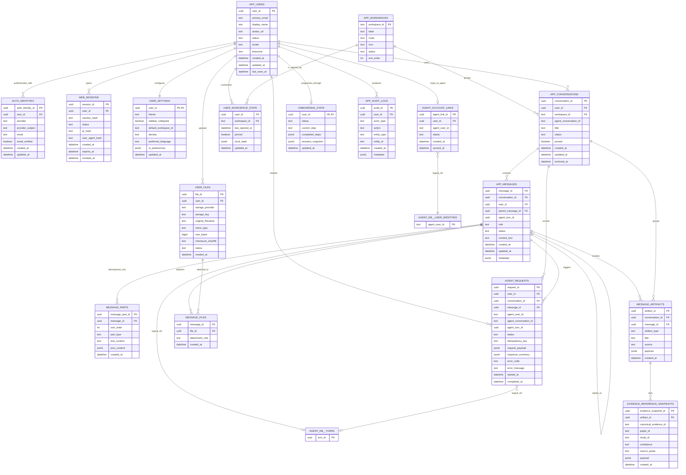

# Victus Web App Database Model V1

Scope: web app database only. Payments are intentionally excluded.

The web app database owns product-facing state: users, auth identities, browser sessions, UI preferences, visible conversations, renderable messages, files, onboarding state, workspace navigation and FastAPI-to-agent request tracking.

The LangGraph/agent database remains owner of agent internals: events, turns, node runs, projector offsets, user projections, conversation summaries and pending interaction state.

Agent references in this model are logical references, not hard cross-database foreign keys.

## Design notes

- `APP_USERS` is the product user. It is not the same table as `AGENT_USER_IDENTITIES`.
- `AUTH_IDENTITIES` supports Google OAuth first, but leaves room for passwordless or enterprise SSO later.
- `WEB_SESSIONS` supports HttpOnly session cookies. Store only a hash of the session token.
- `AGENT_ACCOUNT_LINKS` maps the web product user to the agent user identity.
- `APP_CONVERSATIONS` is the visible thread list owned by the web product. `agent_conversation_id` links to LangGraph/agent state.
- `APP_MESSAGES` stores renderable chat history for the UI. It should not store every LangGraph internal event.
- `MESSAGE_PARTS` exists because future messages may contain text, tool notices, charts, tables, source lists or structured blocks.
- `MESSAGE_ARTIFACTS` stores renderable UI cards such as evidence cards, plan cards, trace summaries and metric cards.
- `EVIDENCE_REFERENCE_SNAPSHOTS` stores a UI snapshot of evidence references used in an answer. The canonical scientific truth remains in the evidence/RAG system.
- `AGENT_REQUESTS` gives FastAPI observability and retry/idempotency without reading the agent database for every UI action.
- `APP_WORKSPACES` should seed V1 rows: `chat`, `diets`, `biometrics`, `profile`, `about`.
- `USER_SETTINGS.sidebar_collapsed` persists the new collapsible sidebar behavior.
